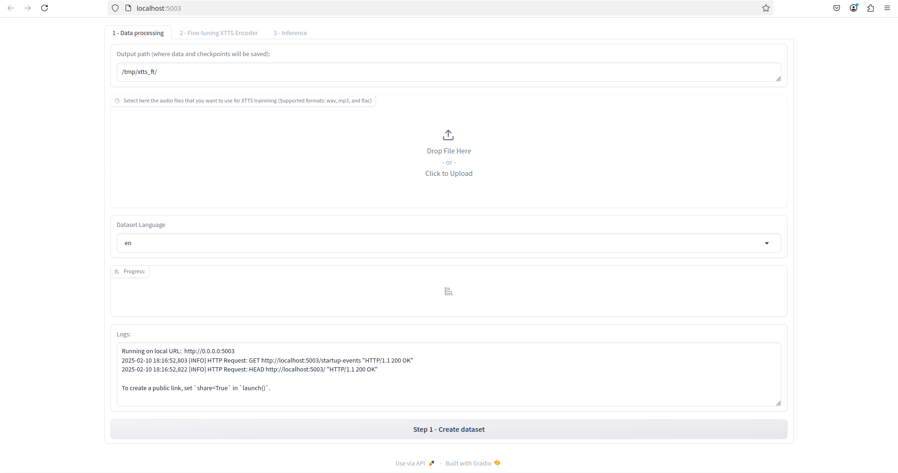

# XTTS with Gradio for AI Training

This repository copies most of the files from [Coqui-TTS](https://github.com/coqui-ai/TTS), with some changes in order to create an image with correct dependencies for AI voice training in Web UI .

Some of the changes include:

- The `Dockerfile`;
- Frozen pip dependencies: `requirements.frozen.txt`;
- `./TTS/demos/xtts_ft_demo/xtts_demo.py` does not create a public link and disables analytics;
- `./TTS/demos/xtts_ft_demo/utils/formatter.py` set to use Whisper's `large-v3` model.


## Build the Docker/Podman Image

Install [Docker](https://www.docker.com/) or [Podman](https://podman.io/) and adapt the commands accordingly:

```
podman build . -t xtts_gradio
```

## Pulling the Image

Instead of building the image from source, you can pull it from ghcr.io:

```
podman pull ghcr.io/lvxvvv/xtts_gradio:latest
```

## Running the Container

If you are using Podman, simply run:

```
./run.sh
```

The following command will be executed:

```
podman run -it --gpus all -p 5003:5003 --entrypoint python3 xtts_gradio /root/tts/TTS/demos/xtts_ft_demo/xtts_demo.py
```

If you are using docker, modify this file so it uses `docker` instead of `podman`.

This commands runs the container with an entrypoint that initializes the Web UI. It will be served on port `5003` on your localhost:



## License

Since this repo's purpose is the creation of a working Web UI from the original repo, it will follow MPL-2.0, the same as in [Coqui-TTS](https://github.com/coqui-ai/TTS). For legal questions about the use of this tool, the user must refer to Coqui's page.